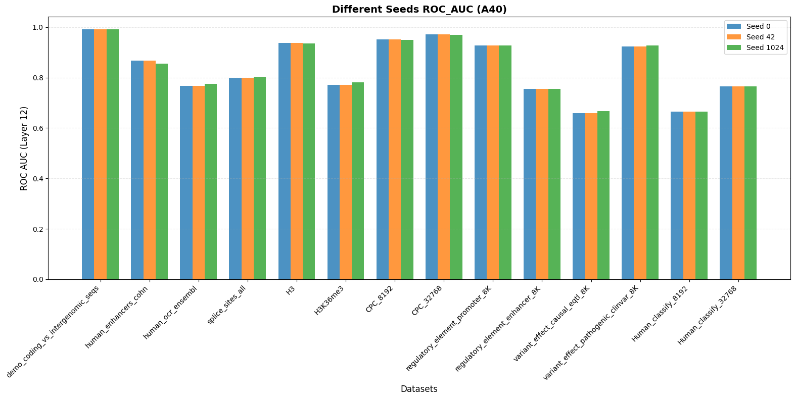
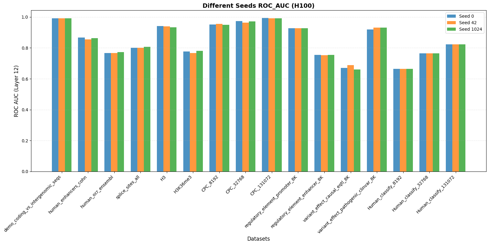
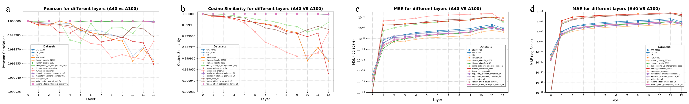
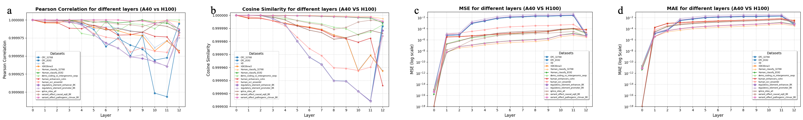
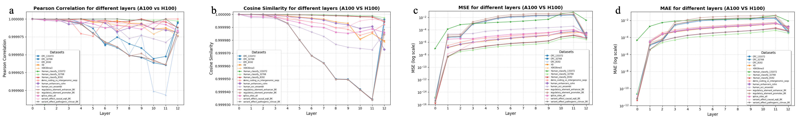
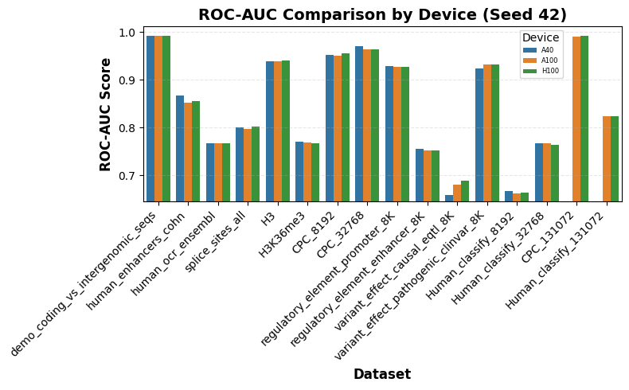
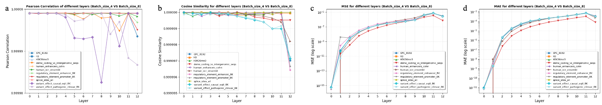
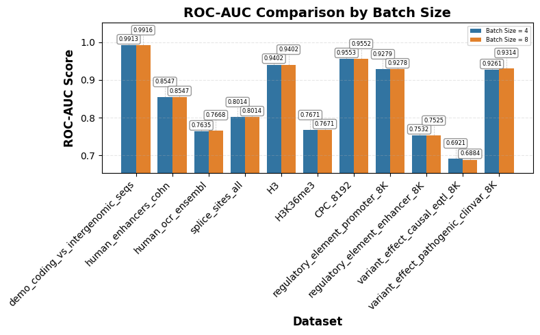
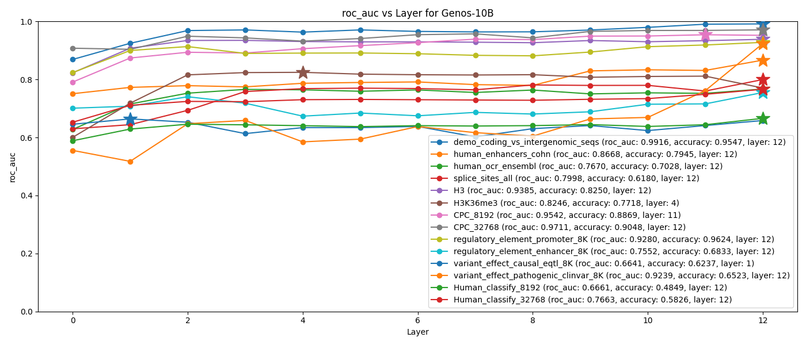
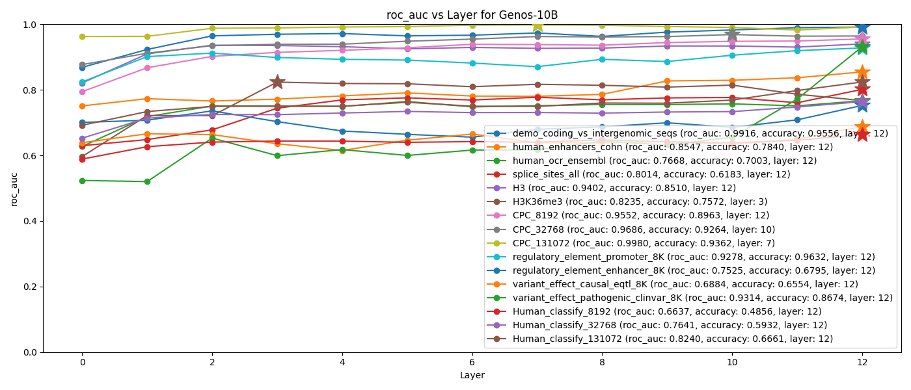

# Genos-10B 测评一致性技术报告

Xuyang Feng，Combo L. M.

------

​	Genos Team此前发布的内容中，公布了Genos-10B模型在各数据集上的测评结果。在使用该模型的过程中，我们发现测评结果会受到多种因素的影响，例如随机种子、测评设备、批次大小等。我们较为详细的评估了这些因素对测评结果的影响，为该模型的使用者提供一定的参考。此技术报告涉及的测试由受托的第三方实施，第三方使用的云算力集群涵盖了A40，A100、H100三种型号。

## 一、方法

- ### 测评框架

​	[测评框架](https://github.com/BGI-HangzhouAI/Genos/tree/main/Technical_Notes/benchmarks-code)已经开源并且发布在GitHub上，所有测试均使用该框架进行。

- ### embedding提取和测评

​	在测评框架中，embedding来自于模型相应层hidden state的mean pooling结果。测评使用embedding对mlp、xgboost进行训练和评估。具体内容见GitHub项目代码，相关数据集的具体信息见```benchmarks/datasets_info.yaml```文件，部分短序列数据集使用了[genomic benchmark](https://huggingface.co/katarinagresova)<sup>[1]</sup>和[nucleotide transformer](https://huggingface.co/datasets/InstaDeepAI/nucleotide_transformer_downstream_tasks)<sup>[2]</sup>两个公共数据集，长序列测评的数据集和处理方式在[Genos项目](https://huggingface.co/datasets/BGI-HangzhouAI)<sup>[3]</sup>中提供。综合测评时间和全面性，我们对```demo_coding_vs_intergenomic_seqs```、```human_enhancers_cohn```、```human_ocr_ensembl```、```splice_sites_all```、```H3```、```H3K36me3```、```CPC_8192```、```CPC_32768```、```CPC_131072```、```regulatory_element_promoter_8K```、```regulatory_element_enhancer_8K```、```variant_effect_causal_eqtl_8K```、```variant_effect_pathogenic_clinvar_8K```、```Human_classify_8192```、```Human_classify_32768```、```Human_classify_131072```等16个数据集进行测评，其中```CPC_131072```和```Human_classify_131072```两个数据集的测评会使A40显存溢出，只在A100和H100上进行测试。

- ### 验证随机种子的影响

​	在测评框架中，仅改变随机数种子完成三次测评，其他参数保持一致（输出路径除外），比较三次测评流程得到的embedding和roc-auc分数。

- ### 验证评估设备的影响

​	每组随机种子实验，分别在NVIDIA的A100，A40，H100三个型号的GPU上进行测评，比较不同设备上的测评结果。

- ### 验证批次大小的影响

​	在H100平台上，选取部分数据集，改变测评batch_size，比较batch_size的变化对推理和测评结果的影响。

- ### 不同层embedding的评估效果

​	提取模型不同层的embedding做测评。

## 二、结果与讨论

​	我们在多个平台（A100，A40，H100）使用不同随机种子（0、42、1024）进行测评。我们的测评流程分为提取embedding、任务头训练两个部分，因此对不同的影响因素进行测评时，我们尽可能地拆分这两个过程。

### 1. 随机种子

#### 1.1 随机种子对embedding的影响

​	为确定随机种子对embedding的影响，我们在所有平台上均使用0、42、1024这三种随机种子进行embedding提取，结果如表1所示，实验结果表明，在此测评框架下，仅改变随机种子并不会影响embedding的结果。

<p style="text-align:center">表1 同平台上，改变随机种子对embedding的影响</p> 

|                测试平台                 | A40  | A100 | H100 |
| :-------------------------------------: | :--: | :--: | :--: |
| 三个随机种子是否得到完全相同的embedding |  √   |  √   |  √   |


#### 1.2 随机种子对测评结果的影响

​	由于随机种子会影响下游分类模型的初始化、训练过程等，随机种子即使不影响embedding的提取，也会影响最终的测评得分，在此部分，我们在各平台比较不同随机种子造成的最终测评结果差异，如图1.1-1.3所示。从表2统计的最大分差中可以看到，大部分数据集得分受随机种子影响较小，均在1%以内，``` human_enhancers_cohn ```、``` H3K36me3```、```variant_effect_causal_eqtl_8K ```这三个数据集受随机种子影响较大，出现>1%的现象。值得注意的是，三个使用xgboost分类的```Human_classify```数据集的测评得分并未受到随机种子的影响。

<figure>
  
  <figcaption>图1.1 A40多随机种子测评结果</figcaption>
<figure>


<figure>
  
  <figcaption>图1.2 A100多随机种子测评结果</figcaption>
<figure>


<figure>
  
  <figcaption>图1.3 H100多随机种子测评结果</figcaption>
<figure>


<center style="font-size:14px;color:#000000;text-decoration:underline">表2 三种随机种子导致的最大分差</center> 

| 数据集                               | A40最大分差 | A100最大分差 | H100最大分差 |
| ------------------------------------ | ----------- | ------------ | ------------ |
| demo_coding_vs_intergenomic_seqs     | 0.0001      | 0.0004       | 0.0005       |
| human_enhancers_cohn                 | 0.0110      | 0.0128       | 0.0127       |
| human_ocr_ensembl                    | 0.0083      | 0.0025       | 0.0069       |
| splice_sites_all                     | 0.0043      | 0.0113       | 0.0062       |
| H3                                   | 0.0022      | 0.0033       | 0.0081       |
| H3K36me3                             | 0.0117      | 0.0147       | 0.0134       |
| CPC_8192                             | 0.0017      | 0.0033       | 0.0053       |
| CPC_32768                            | 0.0010      | 0.0054       | 0.0086       |
| CPC_131072                           | /           | 0.0025       | 0.0018       |
| regulatory_element_promoter_8K       | 0.0009      | 0.0009       | 0.0009       |
| regulatory_element_enhancer_8K       | 0.0004      | 0.0021       | 0.0022       |
| variant_effect_causal_eqtl_8K        | 0.0091      | 0.0141       | 0.0279       |
| variant_effect_pathogenic_clinvar_8K | 0.0043      | 0.0063       | 0.0123       |
| Human_classify_8192                  | 0.0000      | 0.0000       | 0.0000       |
| Human_classify_32768                 | 0.0000      | 0.0000       | 0.0000       |
| Human_classify_131072                | /           | 0.0000       | 0.0000       |


### 2. GPU设备

#### 2.1 设备对embedding的影响

​	由于硬件与软件优化的协同作用，不同 GPU 在推理时会产生数值差异。为追求性能，同一厂商的不同 GPU（如 NVIDIA的A100 与 H100）在底层架构、Tensor Core 精度支持、指令集和计算单元上存在差异；而驱动、CUDA/cuDNN/cuBLAS 等库和推理框架则会根据 GPU 型号启用不同的并行策略、内核优化与近似算法。在浮点数非结合性的影响下，不同优化路径会导致误差<sup>[4]</sup>。这部分我们测试了不同设备上，池化后的embedding之间的区别，我们对三个设备得到的embedding两两比较，结果如图2所示。

<figure>
  
  <figcaption>图2.1 A40和A100embedding之间的的 a、皮尔森系数，b、余弦相似度，c、均方误差 和d、平均绝对误差</figcaption>
<figure>


<figure>
  
  <figcaption>图2.2 A40和H100embedding之间的的 a、皮尔森系数，b、余弦相似度，c、均方误差 和d、平均绝对误差</figcaption>
<figure>

​						

<figure>
  
  <figcaption>图2.3 A100和H100embedding之间的的 a、皮尔森系数，b、余弦相似度，c、均方误差 和d、平均绝对误差</figcaption>
<figure>


​						

#### 2.2 设备对测评结果的影响

​	继续上一个部分设备对embedding的影响，我们在这部分验证不同的设备对最终测评结果的影响。从图3中可看出，```variant_effect_causal_eqtl_8K```在A40和H100上分差最大，为0.0299，其余数据集上的分差都小于该值。

<figure>
  
  <figcaption>图3 不同设备测评结果的比较</figcaption>
<figure>

​																

### 3. 推理批次

#### 3.1 推理batch对embedding的影响

​	在大语言模型推理中，许多 GPU 核心算子（如矩阵乘法、注意力机制、RMS 归一化等）虽然在同一个批次内部执行是确定性的，但它们通常不具有batch size一致性。当batch size变化时，底层的并行归约计算顺序也会随之改变。由于浮点数运算并不严格满足结合律，不同计算顺序会导致误差。<sup>[5]</sup>在此，我们改变batch size，评估其对embedding的影响。所有皮尔森系数均>0.99998（图4a），余弦相似度>0.999996（图4b），均方误差<10<sup>-5</sup>（图4c），平均绝对误差<10<sup>-3</sup>（图4d）。从均方误差和平均绝对误差可以看出，随着计算的不断加深，这种由于batch size导致的误差有增长趋势。在下一章中我们将会讨论这种误差会多大程度地影响最终的测评结果。

<figure>
  
  <figcaption>图4 batch size=8和batch size=4之间embedding的 a、皮尔森系数，b、余弦相似度，c、均方误差 和d、平均绝对误差</figcaption>
<figure>

#### 3.2 批次大小对测评结果的影响

​	继续上一个部分batch size对推理结果的影响，我们进一步地评估batch size对最后一层测评分数的影响。由图5可知，由于batch size改变，导致分差最大的数据集为```variant_effect_pathogenic_clinvar_8K```，分差为0.0053。值得注意的是在图4a中，```variant_effect_pathogenic_clinvar_8K```这个数据集两种batch size最后一层的皮尔森系数也是最低的，但并不能从余弦相似度（图4b），均方误差（图4c）和平均绝对误差（图4d）方面得到同样的结论。

<figure>
  
  <figcaption>图5 batch size=8和batch size=4的测评结果差异</figcaption>
<figure>

​														


### 4. 模型最优层

​	Genos-10B模型共有12层transformer结构，加上token编码层，可获得0-12共13层embedding，一些模型不推荐使用者选取最后一层的embedding进行下游任务，例如evo2<sup>[6]</sup>。然而为了方便使用和测评，进行了简单的评估之后，我们在上阶段只发布了最后一层的测评结果。在此，我们对所有任务的所有层都做了更为细致的评估。如表所示，为了方便使用，我们在这部分不关心具体的测评结果，我们关心最后一层在数据集上的表现是否最佳。如表3所示，16个数据集中，有7个存在某些平台、某些随机种子下，最后一层不是最佳层的情况。从与最后一层的分差看，```H3K36me3```普遍与最后一层分差较大，在4%到7%之间。```variant_effect_causal_eqtl_8K```在A40seed=0和A100seed=0时分差大于1%。其余数据集的测评结果显示，即使最佳层不是模型的最后一层，最佳层与最后一层的分差也小于1%。图6.1-6.3反映了不同层、不同数据集在各设备的得分，多数数据集得分都在随着层数的增加有提升的趋势。

<center style="font-size:14px;color:#000000;text-decoration:underline">表3 最佳层不是最后一层的具体情况，格式：层数(与最后一层的分差)</center> 

|             设备              |    A40     |            |            |    A100    |            |            |    H100    |            |            |
| :---------------------------: | :--------: | :--------: | :--------: | :--------: | :--------: | :--------: | :--------: | :--------: | :--------: |
|             seed              |     0      |     42     |    1024    |     0      |     42     |    1024    |     0      |     42     |    1024    |
|       human_ocr_ensembl       |     ——     |     ——     |     ——     |     ——     |     ——     | 4(0.0004)  |     ——     |     ——     |     ——     |
|              H3               |     ——     |     ——     |     ——     |     ——     |     ——     | 2(0.0015)  |     ——     |     ——     | 3(0.0028)  |
|           H3K36me3            | 4(0.0542)  | 4(0.0542)  | 3(0.0475)  | 4(0.0574)  | 3(0.0656)  | 4(0.0456)  | 4(0.0442)  | 3(0.0564)  | 4(0.0459)  |
|           CPC_8192            | 11(0.0004) | 11(0.0020) | 11(0.0002) |     ——     | 10(0.002)  |     ——     | 11(0.0023) |     ——     | 11(0.0061) |
|           CPC_32768           |     ——     |     ——     |     ——     | 10(0.0017) | 10(0.0044) | 10(0.0056) |     ——     | 10(0.0043) |     ——     |
|          CPC_131072           |     \      |     \      |     \      | 6(0.0045)  | 6(0.0069)  | 6(0.0046)  | 7(0.0045)  | 7(0.0062)  | 8(0.0043)  |
| variant_effect_causal_eqtl_8K | 1(0.0218)  | 1(0.0056)  |     ——     | 1(0.0128)  |     ——     |     ——     | 1(0.0083)  |     ——     | 1(0.0012)  |

> [!NOTE]
>
> 表格中仅记录最后最后一层不是最优的情况，没列出的数据集或空白单元格代表最后一层为最优

<figure>
  
  <figcaption>图6.1 A40 seed=42 multi-layer测评结果</figcaption>
<figure>


<figure>
  
  <figcaption>图6.2 A100 seed=42 multi-layer测评结果</figcaption>
<figure>


<figure>
  
  <figcaption>图6.3 H100 seed=42 multi-layer测评结果</figcaption>
<figure>
<div>&nbsp;</div>
  
## Citation 引用说明

> Feng, X., & Combo, L. M. (2025). Benchmarks Report of Genos-10B. Zenodo. https://doi.org/10.5281/zenodo.17852591

[](https://doi.org/10.5281/zenodo.17719210)

<div>&nbsp;</div>

<u>**注：本tech notes来自genos team及其他应用genos的团队或个人授权发布**</u>

## 参考文献

1. Grešová K, Martinek V, Čechák D, et al. Genomic benchmarks: a collection of datasets for genomic sequence classification[J]. BMC Genomic Data, 2023, 24(1): 25.
2. Dalla-Torre H, Gonzalez L, Mendoza-Revilla J, et al. Nucleotide Transformer: building and evaluating robust foundation models for human genomics[J]. Nature Methods, 2025, 22(2): 287-297.
3. Lin A, Xie B, Ye C, et al. Genos: A Human-Centric Genomic Foundation Model[J]. GigaScience, 2025: giaf132.
4. Tech report: [Defeating Nondeterminism in LLM Inference.](https://thinkingmachines.ai/blog/defeating-nondeterminism-in-llm-inference/) Sep 10,2025
5. Tech report: [Changing the GPU is changing the behaviour of your LLM.](https://medium.com/@anis.zakari/changing-the-gpu-is-changing-the-behaviour-of-your-llm-0e6dd8dfaaae) May 27, 2024
6. Brixi G, Durrant M G, Ku J, et al. Genome modeling and design across all domains of life with Evo 2[J]. BioRxiv, 2025: 2025.02. 18.638918.


